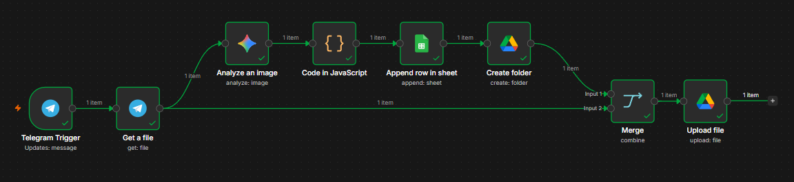

# Telegram Receipt Photo Processing

An n8n workflow that accepts receipt photos sent via Telegram, extracts structured data using Google Gemini, logs it to Google Sheets, and archives the original photo in Google Drive — organized into folders by submission date.

## What It Does

- Listens for photos sent to a Telegram bot
- Downloads the highest-resolution version of each photo
- Sends the image to Google Gemini for analysis, extracting:
  - Merchant name
  - Total amount
  - Date
  - Payment method
  - Receipt/transaction reference number
  - Cashier name
  - Tax/VAT amount
- Logs all extracted fields to a Google Sheet
- Saves the original photo to Google Drive, preserving the original filename
- Groups photos into folders named by the date they were submitted/processed

## Workflow Overview

Telegram Trigger (on message)
→ Get a file (download highest-res photo)
→ Analyze an image (Google Gemini extraction)
→ Code in JavaScript (parse Gemini's JSON response)
→ Append row in sheet (log all 7 fields)
→ Create folder (by submission date)
→ Merge (recombine folder ID with photo binary)
→ Upload file (save original photo)

## Tech Stack

- **n8n** — workflow orchestration
- **Telegram Bot API** — photo intake
- **Google Gemini API** (gemini-3.6-flash) — image analysis and data extraction
- **Google Sheets API** (OAuth2) — logging extracted data
- **Google Drive API** (OAuth2) — photo storage and folder organization

## Screenshots

**Workflow Canvas**

## Demo

A short screen recording showing the workflow processing a receipt photo end-to-end (Telegram → Gemini → Sheets → Drive) is included in this repo: (demo/telegram-photo-processing-demo.mp4)

## Design Notes

The brief specified extracting merchant name, amount, and date as example fields. This implementation extends extraction to include payment method, reference number, cashier name, and tax/VAT amount — additional details commonly found on receipts that add practical value for expense tracking and reconciliation use cases, beyond the minimum requested fields.

## Known Limitations

This is a working proof-of-concept. Testing surfaced a few real-world edge cases worth noting, along with how a production version would address them:

- **Duplicate folder creation**: Folder creation doesn't check for an existing folder with the same date before creating a new one. Sending multiple receipts on the same day currently creates multiple same-named folders rather than reusing one. A production version would add a search-before-create step.
- **No handling for non-receipt images**: If a sent photo isn't a readable receipt, Gemini's response may not parse as valid JSON, which would fail the Code node's parsing step for that execution. A production version would add error handling to gracefully skip or flag unparseable images.
- **No Gemini API rate-limit handling**: Rapid bursts of photos could hit Google AI Studio's free-tier rate limits, causing individual executions to fail. A production version would add retry logic with backoff.

## Setup

1. Create a Telegram bot via [@BotFather](https://t.me/BotFather) and obtain the API token
2. Import `workflow.json` into your n8n instance
3. Connect your own Telegram Bot, Google Gemini, Google Sheets, and Google Drive credentials
4. Point the Google Sheets node to your own spreadsheet with columns: `merchant`, `amount`, `date`, `paymentMethod`, `referenceNumber`, `cashierName`, `tax`
5. Activate the workflow to begin listening for incoming Telegram photos
